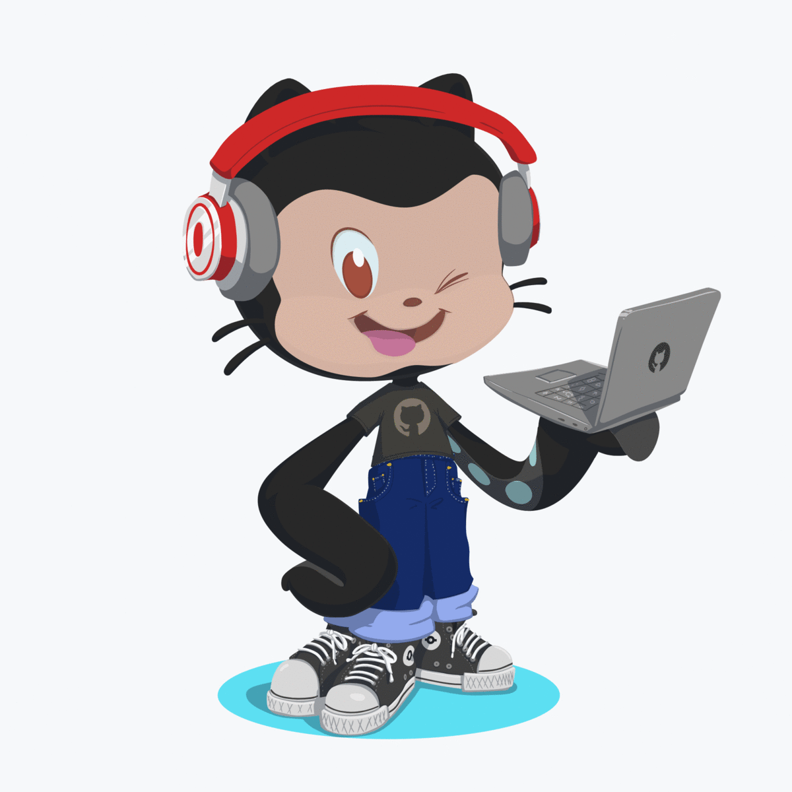

## Hi, I'm White-Mask 👋
---

- 👨🏽‍💻  I’m a student of Ingenieria civil informatica. (Unab)
- 🔭 I am currently working on my personal and university projects.
- :octocat: Second profile: [@TheBlckCat](https://github.com/theblckcat)
- 📰 Medium: [@TheBlckCat](https://medium.com/@TheBlckCat)
-  Twitter: [@WHTMask_](https://twitter.com/WHTMask_)

 
 

### 🧰Languages and Tools

<!-- C -->

<!-- C++ -->

<!-- Django -->

<!-- Python -->

<!-- Git -->

<!-- Linux -->

<!--
# web icons https://devicon.dev/
**White-Mask/White-Mask** is a ✨ _special_ ✨ repository because its `README.md` (this file) appears on your GitHub profile.

Here are some ideas to get you started:

- 🔭 I’m currently working on ...
- 🌱 I’m currently learning ...
- 👯 I’m looking to collaborate on ...
- 🤔 I’m looking for help with ...
- 💬 Ask me about ...
- 📫 How to reach me: ...
- 😄 Pronouns: ...
- ⚡ Fun fact: ...
-->
